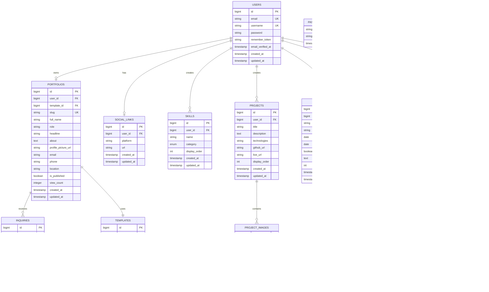

# Portfolio Builder — Database Schema

## 1. Entity Relationship Diagram



---

## 2. Table Definitions

### 2.1 `users`
Stores authentication and identity core.

| Column | Type | Constraints | Notes |
|--------|------|-------------|-------|
| id | BIGINT UNSIGNED | PK, AI | |
| email | VARCHAR(255) | UNIQUE, NOT NULL | Used for login |
| username | VARCHAR(50) | UNIQUE, NOT NULL | Public URL slug |
| password | VARCHAR(255) | NOT NULL | bcrypt hash |
| email_verified_at | TIMESTAMP | NULL | |
| remember_token | VARCHAR(100) | NULL | |
| created_at | TIMESTAMP | DEFAULT CURRENT_TIMESTAMP | |
| updated_at | TIMESTAMP | DEFAULT CURRENT_TIMESTAMP | auto-update |

### 2.2 `portfolios`
Denormalized public profile record for fast reads.

| Column | Type | Constraints | Notes |
|--------|------|-------------|-------|
| id | BIGINT UNSIGNED | PK, AI | |
| user_id | BIGINT UNSIGNED | FK → users.id, UNIQUE | One portfolio per user at launch |
| template_id | BIGINT UNSIGNED | FK → templates.id | |
| slug | VARCHAR(50) | UNIQUE, NOT NULL | Mirrors users.username |
| full_name | VARCHAR(120) | NOT NULL | |
| role | VARCHAR(120) | NULL | |
| headline | VARCHAR(255) | NULL | |
| about | TEXT | NULL | |
| profile_picture_url | VARCHAR(500) | NULL | Cloudinary URL |
| email | VARCHAR(255) | NULL | Contact email shown publicly |
| phone | VARCHAR(30) | NULL | |
| location | VARCHAR(120) | NULL | |
| is_published | BOOLEAN | DEFAULT FALSE | |
| view_count | BIGINT UNSIGNED | DEFAULT 0 | |
| created_at | TIMESTAMP | | |
| updated_at | TIMESTAMP | | |

### 2.3 `social_links`
External links for a user.

| Column | Type | Constraints |
|--------|------|-------------|
| id | BIGINT UNSIGNED | PK, AI |
| user_id | BIGINT UNSIGNED | FK → users.id, CASCADE DELETE |
| platform | VARCHAR(50) | NOT NULL | linkedin, github, website, twitter |
| url | VARCHAR(500) | NOT NULL |
| created_at | TIMESTAMP | |
| updated_at | TIMESTAMP | |

### 2.4 `skills`

| Column | Type | Constraints |
|--------|------|-------------|
| id | BIGINT UNSIGNED | PK, AI |
| user_id | BIGINT UNSIGNED | FK → users.id, CASCADE DELETE |
| name | VARCHAR(100) | NOT NULL |
| category | ENUM | frontend, backend, database, devops, ai, tools |
| display_order | INT | DEFAULT 0 |
| created_at | TIMESTAMP | |
| updated_at | TIMESTAMP | |

### 2.5 `experiences`

| Column | Type | Constraints |
|--------|------|-------------|
| id | BIGINT UNSIGNED | PK, AI |
| user_id | BIGINT UNSIGNED | FK → users.id, CASCADE DELETE |
| company | VARCHAR(150) | NOT NULL |
| position | VARCHAR(150) | NOT NULL |
| start_date | DATE | NOT NULL |
| end_date | DATE | NULL |
| is_current | BOOLEAN | DEFAULT FALSE |
| description | TEXT | NULL |
| display_order | INT | DEFAULT 0 |
| created_at | TIMESTAMP | |
| updated_at | TIMESTAMP | |

### 2.6 `educations`

| Column | Type | Constraints |
|--------|------|-------------|
| id | BIGINT UNSIGNED | PK, AI |
| user_id | BIGINT UNSIGNED | FK → users.id, CASCADE DELETE |
| institution | VARCHAR(200) | NOT NULL |
| degree | VARCHAR(200) | NOT NULL |
| year | VARCHAR(20) | NOT NULL |
| description | TEXT | NULL |
| display_order | INT | DEFAULT 0 |
| created_at | TIMESTAMP | |
| updated_at | TIMESTAMP | |

### 2.7 `projects`

| Column | Type | Constraints |
|--------|------|-------------|
| id | BIGINT UNSIGNED | PK, AI |
| user_id | BIGINT UNSIGNED | FK → users.id, CASCADE DELETE |
| title | VARCHAR(200) | NOT NULL |
| description | TEXT | NULL |
| technologies | VARCHAR(500) | NULL | comma-separated |
| github_url | VARCHAR(500) | NULL |
| live_url | VARCHAR(500) | NULL |
| display_order | INT | DEFAULT 0 |
| created_at | TIMESTAMP | |
| updated_at | TIMESTAMP | |

### 2.8 `project_images`

| Column | Type | Constraints |
|--------|------|-------------|
| id | BIGINT UNSIGNED | PK, AI |
| project_id | BIGINT UNSIGNED | FK → projects.id, CASCADE DELETE |
| image_url | VARCHAR(500) | NOT NULL |
| public_id | VARCHAR(255) | NULL | Cloudinary public_id |
| display_order | INT | DEFAULT 0 |
| created_at | TIMESTAMP | |
| updated_at | TIMESTAMP | |

### 2.9 `resumes`

| Column | Type | Constraints |
|--------|------|-------------|
| id | BIGINT UNSIGNED | PK, AI |
| user_id | BIGINT UNSIGNED | FK → users.id, CASCADE DELETE |
| file_url | VARCHAR(500) | NOT NULL |
| public_id | VARCHAR(255) | NULL |
| original_name | VARCHAR(255) | NOT NULL |
| download_count | INT | DEFAULT 0 |
| created_at | TIMESTAMP | |
| updated_at | TIMESTAMP | |

### 2.10 `templates`

| Column | Type | Constraints |
|--------|------|-------------|
| id | BIGINT UNSIGNED | PK, AI |
| slug | VARCHAR(50) | UNIQUE, NOT NULL |
| name | VARCHAR(100) | NOT NULL |
| description | VARCHAR(500) | NULL |
| thumbnail_url | VARCHAR(500) | NOT NULL |
| is_active | BOOLEAN | DEFAULT TRUE |
| config | JSON | NULL | theme tokens, supported sections |
| created_at | TIMESTAMP | |
| updated_at | TIMESTAMP | |

### 2.11 `inquiries`

| Column | Type | Constraints |
|--------|------|-------------|
| id | BIGINT UNSIGNED | PK, AI |
| portfolio_id | BIGINT UNSIGNED | FK → portfolios.id, CASCADE DELETE |
| visitor_name | VARCHAR(120) | NOT NULL |
| visitor_email | VARCHAR(255) | NOT NULL |
| subject | VARCHAR(200) | NOT NULL |
| message | TEXT | NOT NULL |
| is_read | BOOLEAN | DEFAULT FALSE |
| created_at | TIMESTAMP | |
| updated_at | TIMESTAMP | |

### 2.12 `password_resets`
Laravel default.

| Column | Type | Constraints |
|--------|------|-------------|
| email | VARCHAR(255) | PK |
| token | VARCHAR(255) | NOT NULL |
| created_at | TIMESTAMP | |

---

## 3. Relationships

| Parent | Child | Type | On Delete |
|--------|-------|------|-----------|
| users | portfolios | one-to-one | CASCADE |
| users | social_links | one-to-many | CASCADE |
| users | skills | one-to-many | CASCADE |
| users | experiences | one-to-many | CASCADE |
| users | educations | one-to-many | CASCADE |
| users | projects | one-to-many | CASCADE |
| users | resumes | one-to-one | CASCADE |
| projects | project_images | one-to-many | CASCADE |
| portfolios | inquiries | one-to-many | CASCADE |
| templates | portfolios | one-to-many | RESTRICT |

---

## 4. Indexing Strategy

```sql
-- Unique lookups
CREATE UNIQUE INDEX idx_users_email ON users(email);
CREATE UNIQUE INDEX idx_users_username ON users(username);
CREATE UNIQUE INDEX idx_portfolios_slug ON portfolios(slug);
CREATE UNIQUE INDEX idx_portfolios_user_id ON portfolios(user_id);
CREATE UNIQUE INDEX idx_templates_slug ON templates(slug);

-- Foreign key indexes
CREATE INDEX idx_portfolios_template_id ON portfolios(template_id);
CREATE INDEX idx_social_links_user_id ON social_links(user_id);
CREATE INDEX idx_skills_user_id ON skills(user_id);
CREATE INDEX idx_experiences_user_id ON experiences(user_id);
CREATE INDEX idx_educations_user_id ON educations(user_id);
CREATE INDEX idx_projects_user_id ON projects(user_id);
CREATE INDEX idx_project_images_project_id ON project_images(project_id);
CREATE INDEX idx_inquiries_portfolio_id ON inquiries(portfolio_id);

-- Composite ordering indexes
CREATE INDEX idx_skills_user_order ON skills(user_id, display_order);
CREATE INDEX idx_experiences_user_order ON experiences(user_id, display_order DESC);
CREATE INDEX idx_educations_user_order ON educations(user_id, display_order DESC);
CREATE INDEX idx_projects_user_order ON projects(user_id, display_order);

-- Search/filter support
CREATE INDEX idx_inquiries_is_read ON inquiries(portfolio_id, is_read);
```

---

## 5. Data Integrity Rules

1. `users.username` must be URL-safe (`/^[a-z0-9_-]+$/`).
2. `portfolios.slug` always mirrors `users.username` for consistency.
3. `experiences.is_current = true` implies `end_date` is NULL.
4. `projects.technologies` stored as comma-separated for simplicity; parse on read.
5. `resumes` limited to one row per user at the application layer.
6. `templates.config` JSON validated against a schema in code.

---

## 6. Seeding Strategy

Seed the `templates` table with the five launch templates and at least one admin/demo user. Do not seed sensitive or real user data.

```sql
INSERT INTO templates (slug, name, description, thumbnail_url, is_active, config)
VALUES
('modern-developer', 'Modern Developer', 'Dark, professional, tech-focused', '...', true, '{}'),
('minimal-portfolio', 'Minimal Portfolio', 'Clean, white, elegant', '...', true, '{}'),
('creative-portfolio', 'Creative Portfolio', 'Vibrant, animation-heavy', '...', true, '{}'),
('corporate-portfolio', 'Corporate Portfolio', 'Business oriented', '...', true, '{}'),
('premium-dark', 'Premium Dark Portfolio', 'Luxury feel, premium animations', '...', true, '{}');
```
